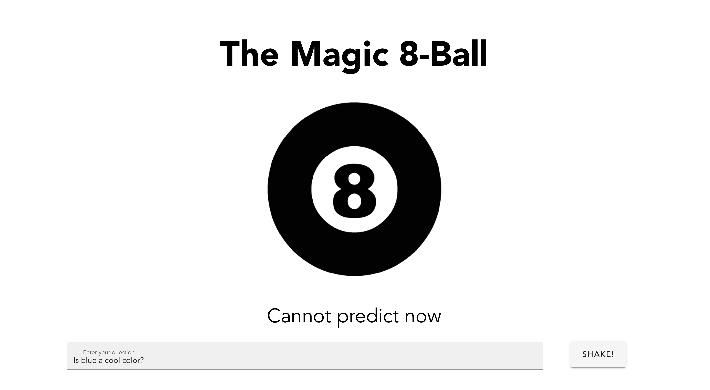
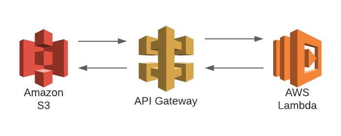
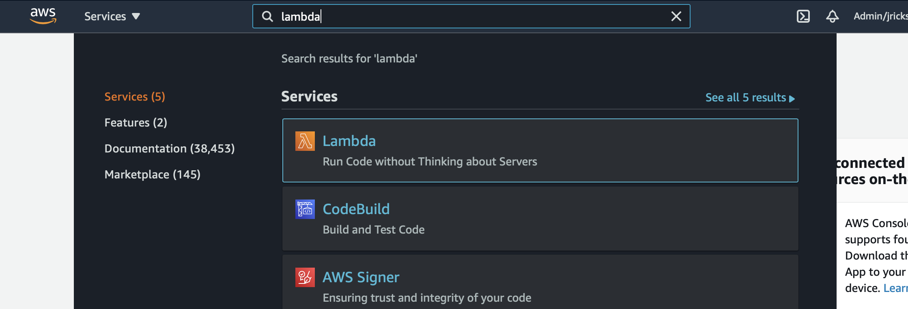
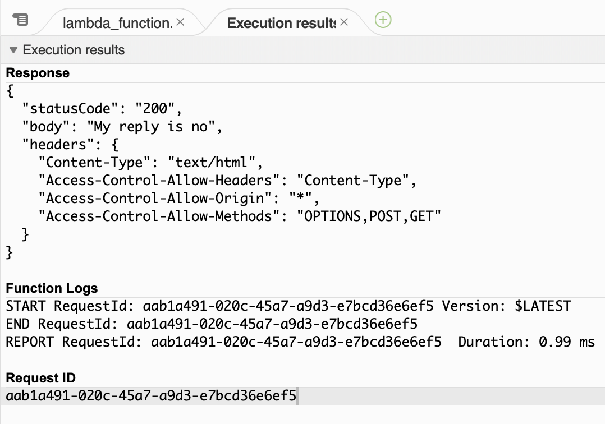
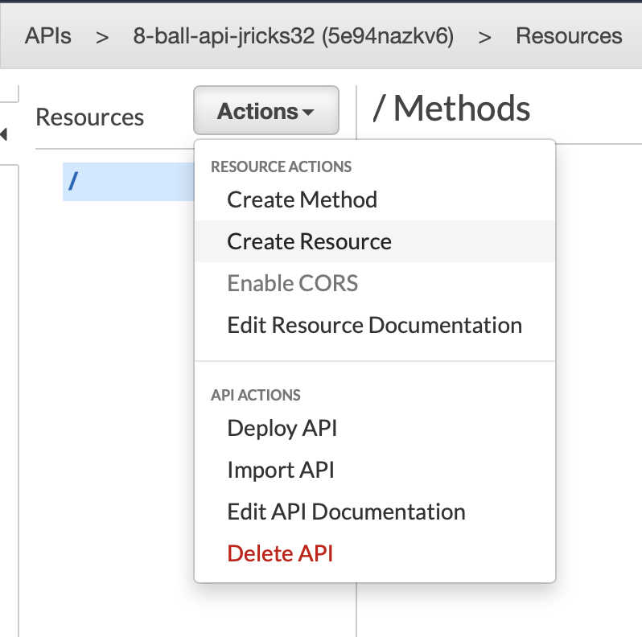
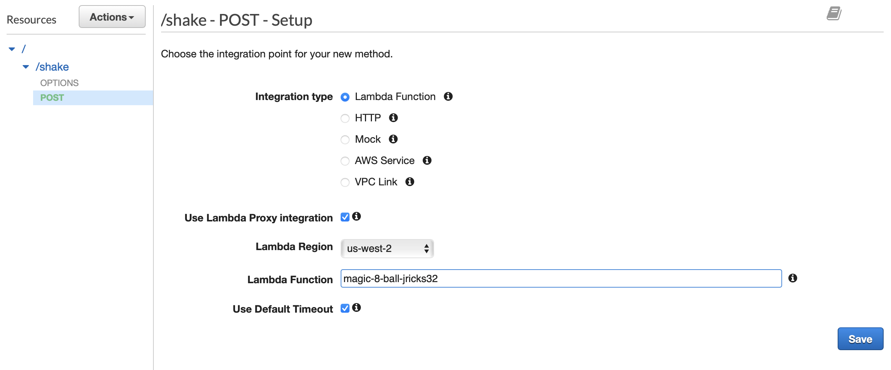
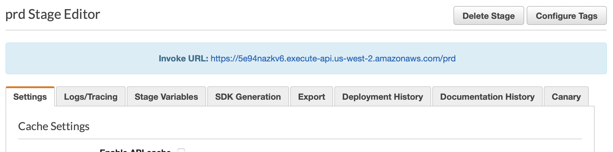
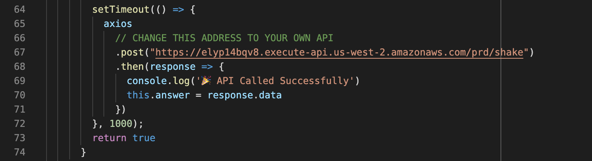
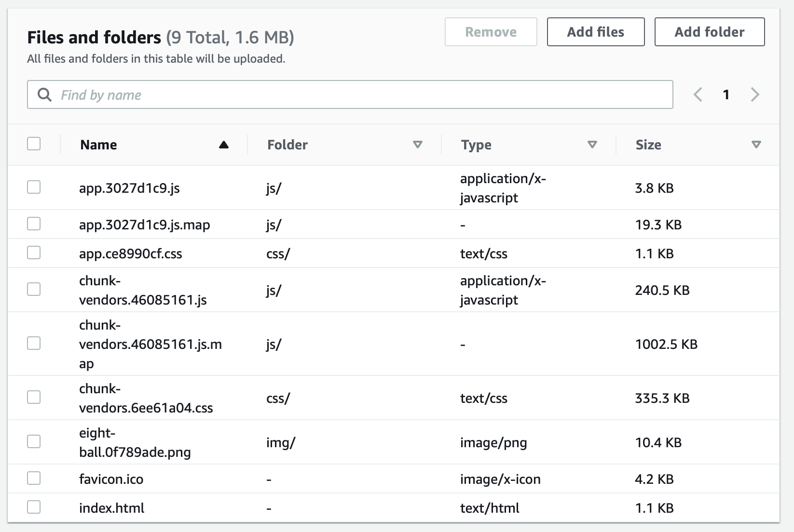

# Serverless Workshop
### Presented by Jordan Ricks 

<br>
Welcome to the serverless workshop for the 2021 Cloud Conference!

In this lab we will be creating a magic 8-ball that will help guide you whenever you have difficult discsions to make.



<br>

### In this lab we will:
* Create a lambda fuction to return the answer form our magic 8-ball
* Create an API that our website will use to trigger the lambda
* Create and configure an S3 bucket to host our website



<br>
Before we begin, please make sure you have access to an AWS account. If you need access to the training account, go to https://go.byu.edu/AWSTrainingAccountRequest to request access. (You should be able to get access within a minute or two).

To log into the AWS console, go to awslogin.byu.edu and sign in using your BYU credentials. You should see the byu-org-trn account. Select the PowerUser role and sign in.

Check to make sure you are in the US West (Oregon) region. You can find which region you are in by checking which region is listed in the top right corner of the console.

I would also reccomend downloading this repo to your local machine. You will need to upload some of the files to our S3 bucket to make it work properly.


Great! Let's get started!
<br>
<br>

# Instructions

## Creating our lambda function
This very basic lambda function will choose a random answer from a list of answers, and return it.

1. Navigate to the lambda page by searching for lambda in the AWS search bar at the tp of the console. Select Lambda. 
2. You will be greeted by a list of lambda functions. You can ignore these for now. Click on the orange "Create Function" button.
3. Give your fuction a good name (ie. magic-8-ball-myNetid). Select the Python 3.8 runtime, and leave everything else as default and push the "Create lambda" button near the bottom.
4. Your lambda function is now created, but it can't do much until we add some code. Scroll down to the 'Function Code' section, and double click on 'lambda_function.py' to open it.
5. In a separate tab, open this github repo and copy the lambda function at ./lambda/magic-8-ball.py. Paste it into your lambda function code.
6. Push deploy
7. To test your code, push the 'Test' button. It will ask you to configure a test event. For this function, the body of the test event does not matter. Just give the test event a name and push save. Hit the 'Test' button again. You should see the exucution results appear in the cosole. You should see something similar to this: 

And just like that your lambda function is ready to go! 
<br>
<br>

## Creating the API
Next we need to create the API which will allow us to connect the button on our website to our lambda function.

1. Navigate to the API gateway console by searching for API Gateway in the AWS search bar. Select API Gateway
2. Here is a list of all APIs in this account. Your API will show up here once we create it. Click on the orange 'Create API' button.
3. Select REST API and push build.
4. Give your API a good name (ie 8-ball-api-myNetid) and push create API.
5. Click on the Actions drop down menu, and select Create Resource. A resource is like an endpoint of your API, and can perform different actions based on which method requests it. 
6. For resource name enter 'shake'. Be sure to check the 'Enable API Gateway CORS' check box, or else your API may not work properly. Push 'Create Resource'
7. We need to add a POST method to handle POST requests. Make sure you have the /shake resource selected and then click on the actions drop down menu. Select 'Create Method'. A small box will appear below OPTIONS. Slect the POST method, and push the check mark. 
8. To configure the POST method, click on it. Select the Lambda Funtion integration type. Check the use lambda proxy integration box. Type in the name of your lambda function you just created and select it. Push Save and OK. 
9. Again click on the actions drop-down menu. This time select 'Enable CORS'. Leave all the options as is, and push the 'Enable CORS and replace existing CORS headers' button. Confirm the action. This will make sure that our website has permission to call an API.
10. To test your API, click on the 'Test' button. Input nothing in Query String, Headers, or Request Body. Scroll to the bottom and hit 'Test'. You will see the exucution results show up on the right side. If your API is hooked up correctly to your lambda function, you should see it return a 200 response, and a random answer from your magic 8-ball lambda. If you continue to push the 'Test' button, you will fins that the answer the lambda returns is different every time.
11. Now we need to deploy our API. From the Actions drop-down menu, select 'Deploy API'
12. Select [New Stage], and input the name of your deployment (ie. prd) and a description if you wish. Push deploy
13. At the top of console you should see your API's Invoke URL. Be sure to copy this URL now and paste it somewhere you can use it. We will need this URL in the next section. 

Now your API is set up and ready to go. The last step will be to set up the S3 bucket.
<br>
<br>

## Creating Our S3 Bucket

We need a way to interact with our magic 8-ball. We will set up S3 to host our website.

1. Navigate to the S3 console by searching for S3 in the AWS search bar
2. Here is a list of all S3 buckets in the account. To create a bucket, click the orange 'Create Bucket' button.
3. Give your bucket a good unique name. (ie. magic-8-ball-myNetid). Caution: this name must be globally unique!
4. Make sure the region selected is US West (Oregon)
5. Uncheck the "Block all public". We need to make our bucket public in order to acccess it as a website later. Check the box that says you acknowledge the change.
6. Enable encryption. It is required. If you don't enable encryption, automated processes will.
7. Push 'create bucket'.
8. Click on your bucket. Go to properties and scroll all the way to the bottom. Click the 'Edit' button in the Static Website Hosting box. Enable and enter in 'index.html' into the index and error document fields. Push Save Changes.

## Changing the API URL
For our website to work we will need to add your API URL to the website code.

1. In your project files that you downloaded from git, navigate to /src/components/Shake.vue and edit the file. 

2. Scroll down to line 67, and replace the example URL with your API URL that you copied when you created your API. Add '/shake' to the end of your url. 
3. Save the file.
4. In the console run:
```
npm run build
```
5. Once the project is built, a dist folder will be created. The files inside this folder will need to be uploaded to S3. We will cover how to do that next!

## Uploading our Files to S3

1. Next we need to upload our website files. To do this click on the Objects tab, and click Upload. Drag and drop the all the files inside the dist folder in the github repo. Push upload. 
2. Navigate back to your bucket console. Before we can access our website, we need to give our bucket a bucket policy. Under the permissions tab, click the edit button on the Bucket Policy box. You will need to paste this code into the console:

```
{
    "Version": "2012-10-17",
    "Statement": [
        {
            "Sid": "PublicReadGetObject",
            "Effect": "Allow",
            "Principal": "*",
            "Action": "s3:GetObject",
            "Resource": "arn:aws:s3:::magic-8-ball-myNetid/*"
        }
    ]
}
```


(Be sure to replace "arn:aws:s3:::magic-8-ball-myNetid/*" with the name of your bucket). Push 'Save Changes'.

3. Lets go check out the website! To find the URL for your website, go back to the properites tab, and scoll all the way to the bottom of the page. Your URL will be listed in the Static website hosting box. Go ahead and click on the link. You should be greeted by your magic 8-ball website.
<br>

## Test it out!
Awesome, You are almost done! Lets just test out our new website to make sure everyhting is working correctly.

Ask the 8-ball a question and push shake. You should recieve an answer within a second or two.

<br>
<br>

# Conclusion
Way to go! We created a website that calls an api, which triggers a lambda and send a respose back to our website. All of these run serverlessly and with very low latency and virtually no cost.

Enjoy making decisions with complete confidence with your new found magical descion making device!
